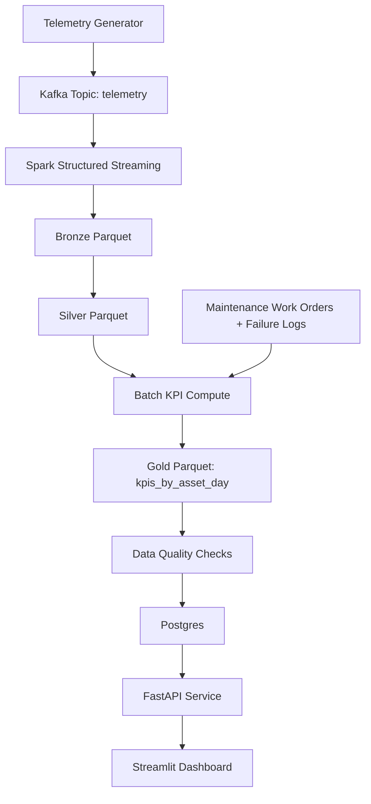

# Oil & Gas Equipment Downtime & Production Loss Analytics Platform

## Problem
Unplanned equipment failures create downtime, reduce throughput, and increase operating cost in oil and gas production.

## Solution
This project implements a deployable data platform that ingests telemetry and maintenance data, computes reliability and production-loss KPIs, and serves them via API and dashboard.

## Architecture
Diagram source: [docs/architecture-diagram.mmd](docs/architecture-diagram.mmd)



## Tech Stack
- Python
- Kafka
- Spark Structured Streaming
- Postgres
- FastAPI
- Streamlit
- Docker Compose
- Great Expectations-compatible DQ + deterministic pandas checks
- Pytest + Ruff + GitHub Actions

## API Endpoints
- `GET /health`
- `GET /kpis`
- `GET /kpis/summary`
- `GET /docs`

## Deploy
```bash
cp .env.example .env
docker compose -f infra/docker-compose.deploy.yml up --build -d
```

After deployment:
- API health: `http://localhost:4000/health`
- API docs: `http://localhost:4000/docs`
- Dashboard: `http://localhost:8501`

## Local Development
```bash
python -m venv .venv
# Windows PowerShell:
.venv\Scripts\Activate.ps1
pip install -r requirements.txt
copy .env.example .env
make gen
make silver-local
make batch
make dq
make load-db
make api
```

In a second terminal:
```bash
make dashboard
```

## Repository Structure
```text
api/                     # FastAPI application
analytics/               # Streamlit app + SQL examples
data_gen/                # Synthetic telemetry and maintenance/failure generation
dq/                      # Data quality checks
infra/                   # Docker Compose files
pipelines/
  streaming/             # Spark streaming pipeline (Kafka -> Bronze/Silver)
  batch/                 # Silver->Gold KPIs + Postgres load/bootstrap
docs/                    # Architecture, runbook, deployment docs
tests/                   # Unit tests
src/                     # Shared config/logging
```
